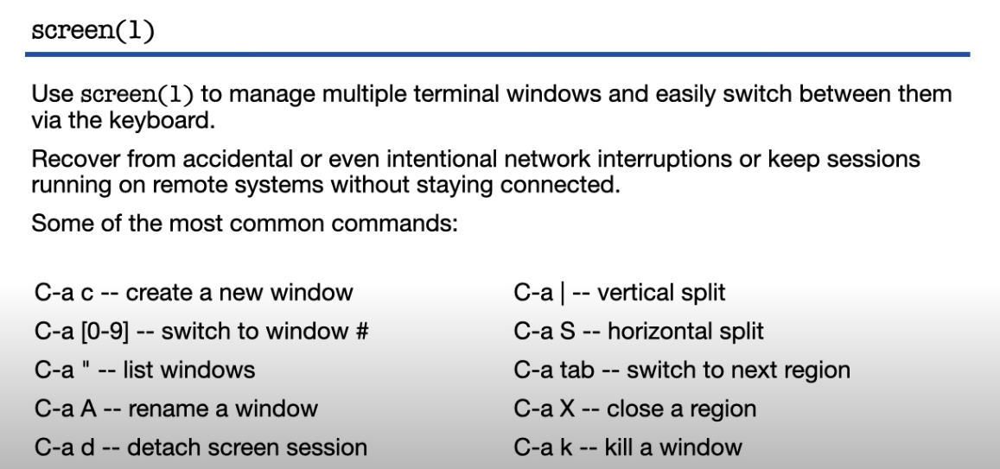
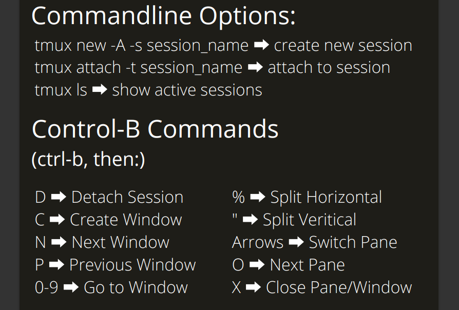

Installation:
sudo pkgin -y install screen

## Tmux
control: ctrl+b
toggle screens: [control] n and p
split: [control] %
switch pane: [control] o
disconnect: [control] d
reconnect: tmux attach

CTags
ctags *
ctrl + }
ctrl  + t
:ta function_name

Exctags
sudo pkgin -y install exctags

vi: echo "set tags=tags\ /home/venu/.tags" >> ~/.exrc
vim: echo "set tags+=~/.tags" >> ~/.vimrc

open man: shift+k