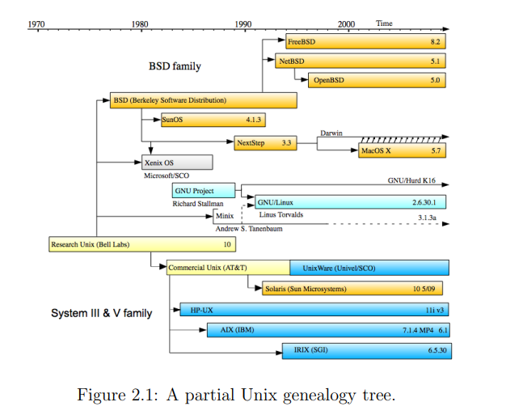

License:
1. GNU GPL - free to use and modify. Modifications should be released with same license
2. BSD - allows for any use of the software whatsoever (including modification and commercial re-selling of the products) so long as credit was given where credit was due.

Useful link:
1. https://distrowatch.com/dwres.php?resource=family-tree