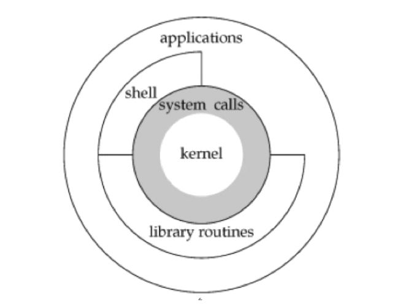

1. OS Design
	1. OS Design: 
	2. System calls are entry points into kernel code. They are documented in section 2 of the manual pages.
	3. Library calls are transfers to user code which performs the desired functions. They are documented in section 3 of the manual pages
2. Useful links:
	1. [Krister Walfridsson’s old blog: Useful GCC warning options not enabled by -Wall -Wextra](https://kristerw.blogspot.com/2017/09/useful-gcc-warning-options-not-enabled.html)
3. Unix Program design
	1. Unix programs...
		1. are simple
		2. follow the element of least surprise
		3. accept input from stdin
		4. generate output to stdout
		5. generate meaningful error messages to stderr
		6. have meaningful exit codes
		7. have a manual page
4. UNIX pipes
	1. Helps combine multiple commands to execute.
	2. stdin - standard input
	3. stdout - standard output
	4. stderr - standard error
5. Files and Directories
	1. tree structure
	2. all partitions mounted under the root (/)
	3. Directories are special files that contain mappings between inodes and filenames, called directory entries.
		1. Inode is an internal data structure to look up the file in the filesystem
6. User Identification
	1. User IDs and group IDs are numeric values used to identify users on the system and grant permissions appropriate to them. 
	2. Group IDs come in two types; primary and secondary.
7. Unix Time values
	1. Epoch time
	2. Process time: central processor resources used by a process. Measured in clock ticks (clock_t). Three values:
		1. clock time
		2. user CPU time
		3. system CPU time
8. Standard I/O
	1. File descriptors: small, non-negative integers which identify a file to the kernel. The shell can redirect any file descriptor.
	2. kernel provides unbuffered I/O through e.g. open(2), read(2), write(2), lseek(2), close(2)
	3. kernel provided buffered I/O through e.g. fopen(3), fread(3), fwrite(3), getc(3), putc(3)
9. Processes
	1. Programs executing in memory are called processes.
	2. Programs are brought into memory via one of the exec(3) / execve(2) functions.
	3. Each process is identified by a guaranteed unique non-negative integer called the processes ID.
	4. New processes can only be created via the fork(2) system call.
	5. Process control is performed mainly via the fork(2), exec(3), and waitpid(2) functions.
10. Signals
	1. Signals notify a process that a condition has occurred.
	2. Signals may be:
		1. allowed to cause the default action.
		2. intentionally and explicitly ignored.
		3. caught and control transferred to a user-defined function.