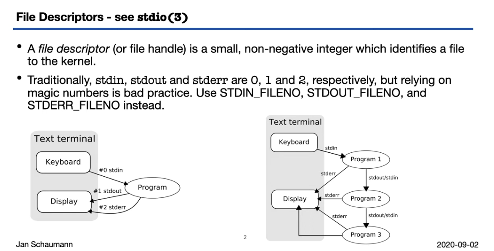

1. Small non-negative integer which identifies a file to the kernel. 
2. The use of an integer value to represent a file helped build tools for file I/O, sockets, network I/O, IPC, etc.
3. Basic Idea: 
4. 
5. 
6. read(2)
	1. .png)
7. write(2)
	1. .png)
8. lseek(2)
	1. .png)
	2. 
	3. Seeking is not possible for all file descriptors
	4. 