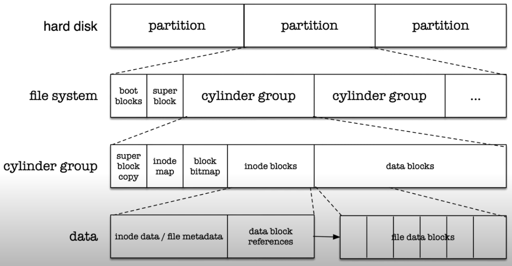
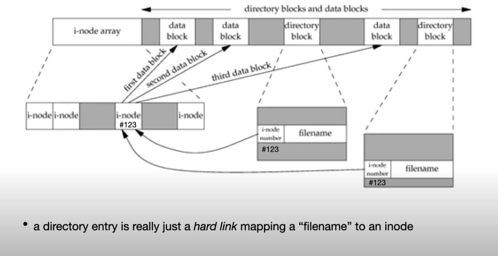
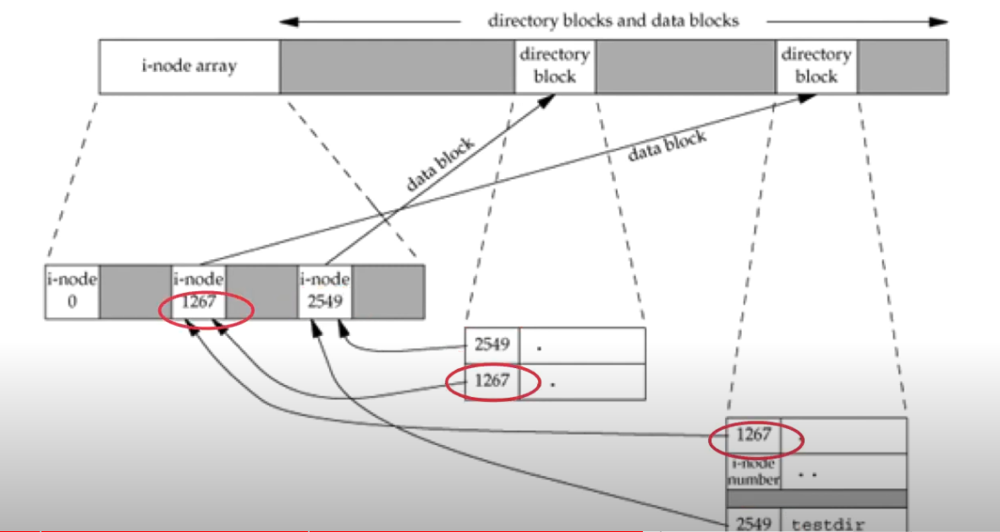

1. A disk can be divided into logical partitions
2. To read the partitions in NetBSD, run the following command
	```
	sudo disklabel wd0
	```
3. File system is created per partition
4. On each logical partition you may create a file sysetm containing the cylinder groups
	1. Addressing of each cylinder group is provided in a super block
5. Each cylinder group has the actual data block
	1. inodes and metadata for the data stored in data blocks is separated into inode blocks, inode map, block bitmap,
	2. Super block for file system is copied to every cylinder block for recovery from corruption
6. Data blocks are divided into data blocks
7. Inode blocks are divided into inode data/file metadata and data block references




8. File names are only directory entries
9. Data blocks containing the actual data are referenced from the inode
10. A directory entry is really just a hard link mapping a filename to an inode




11. Directories are special files containing a list of hard links
12. New directory has two entries be default
	1. . mapping to inode of current directory
	2. .. mapping to inode of parent directory



13. inode number in a directory entry must point to an inode on the same file system.
14. 

